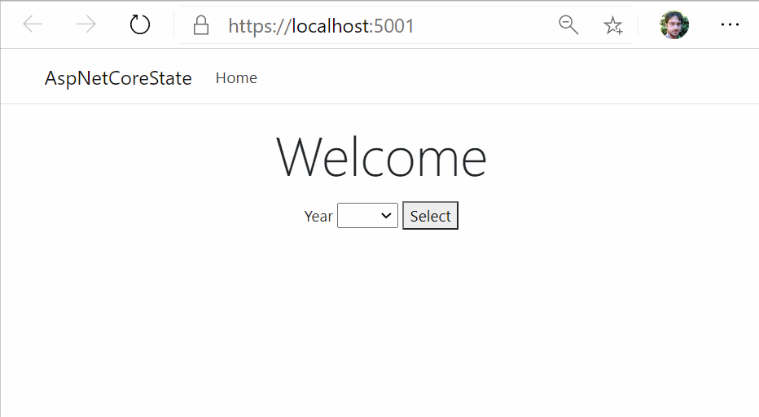

# ASP.NET Core State persistence across requests
This is a ASP.NET Core application for .NET 5.

This branch showcases the use of the **cookies** to persist a value across requests.

> See the `master` branch on how to do the same with the `ISession` object.

 * The request and response cookies collections are configured as services in the [Startup.cs](Startup.cs#L28) file, within the `ConfigureServices` method;
 * Use the `IRequestCookieCollection` and `IResponseCookies` collections object from the [HomeController.cs](Controllers/HomeController.cs#L15). In this demo, a persistent cookie will be created, with an expiration of 30 days.

## Getting started
Download or clone this project, then open it with Visual Studio Code and hit `F5` to start debugging the app.